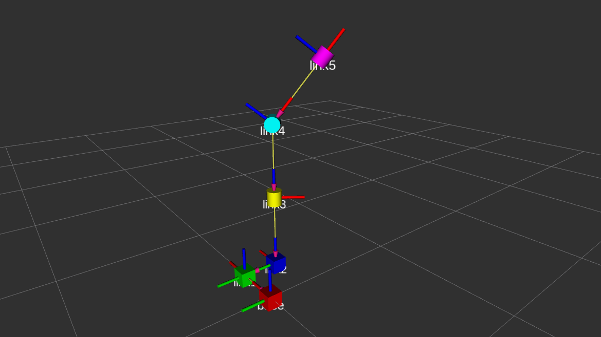
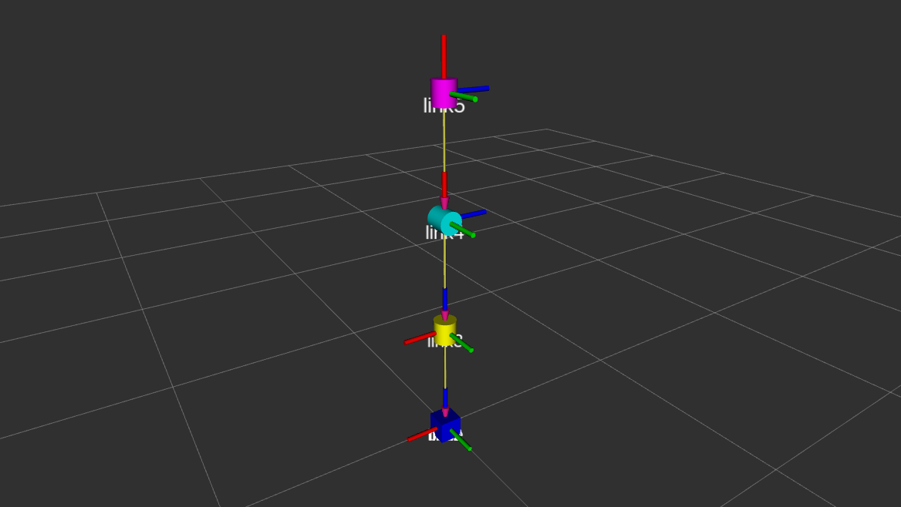

# Assignment 1 - Lev Kozlov

## Description

I decided to implement first two prismatic joints as movements along `XY` axis.

Revolute joints are in configuration `ZYZ`.

Overall configuration is `XYZYZ`.

Robot image from rviz


Zero configuration


## Running package

### Prerequisites

- ROS Noetic

### Running

I expect that you clone this repository into your `catkin_ws/src` folder.

```bash
cd ~/catkin_ws
catkin_make
source devel/setup.bash
roslaunch assignment1 rviz.launch
```
